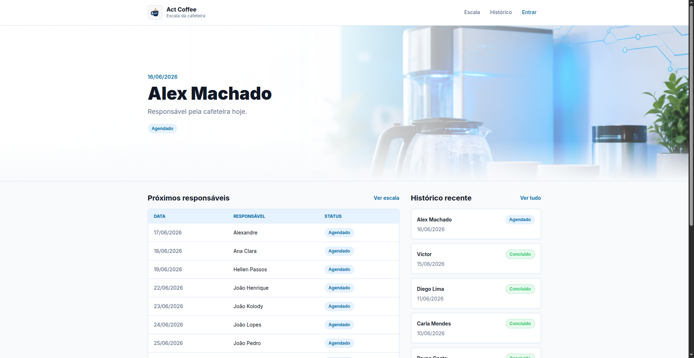

# Act Coffee

Act Coffee é uma aplicação Laravel para organizar automaticamente a escala de lavagem da cafeteira no trabalho.

## Descrição

O sistema substitui uma planilha manual por uma escala pública e uma área administrativa. Qualquer pessoa pode ver quem é o responsável do dia, os próximos responsáveis e o histórico recente. O administrador gerencia funcionários, férias, feriados personalizados e a escala do dia.

## Problema resolvido

A planilha manual não pula fins de semana e feriados automaticamente, não lida bem com férias, desligamentos ou entrada de novos funcionários, e exige manutenção recorrente. O Act Coffee centraliza essas regras e mantém a fila consistente.

## Público-alvo

Equipes internas que compartilham uma cafeteira e precisam dividir a responsabilidade de limpeza de forma simples, justa e previsível.

## Funcionalidades principais

- Visualização pública do responsável de hoje.
- Lista pública dos próximos responsáveis.
- Histórico dos últimos 30 dias.
- Login administrativo.
- CRUD de funcionários.
- Inativação de funcionários sem apagar histórico.
- CRUD de férias.
- CRUD de feriados personalizados.
- Feriados nacionais fixos do Brasil.
- Feriados móveis calculados a partir da Páscoa pelo algoritmo de Meeus.
- Feriados locais de Guarapuava em 09/12.
- Botão para marcar a lavagem como concluída.
- Seleção do funcionário que irá trocar com o responsável do dia.
- Testes automatizados para as principais regras de negócio.

## Print da tela mais interessante



## Requisitos

- PHP 8.2 ou superior.
- Composer.
- Node.js 22 ou superior.
- npm.
- SQLite habilitado no PHP.

## Instalação e execução local

```bash
composer install
npm install
cp .env.example .env
touch database/database.sqlite
php artisan key:generate
php artisan migrate --seed
npm run dev
php artisan serve
```

Acesse:

```text
http://localhost:8000
```

## SQLite e .env.example

O projeto usa SQLite por padrão. O arquivo `.env.example` já vem com:

```env
APP_NAME="Act Coffee"
APP_TIMEZONE=America/Sao_Paulo
DB_CONNECTION=sqlite
```

Se quiser usar um caminho absoluto para o banco, defina `DB_DATABASE` no `.env`. Caso contrário, o Laravel usa `database/database.sqlite`.

## Credenciais de teste

O seeder cria um usuário administrativo:

```text
Email: admin@example.com
Senha: password
```

## Módulos da disciplina usados

1. Módulo 4 - Rotas, MVC, Controllers, Actions e Services
2. Módulo 5 - Blade e Server Side Rendering
3. Módulo 6 - TailwindCSS
4. Módulo 7 - Validação de dados
5. Módulo 8 - Autenticação
6. Módulo 9 - Migrations, Models e Eloquent ORM
7. Módulo 10 - Testes automatizados, factories e seeders

## Onde cada módulo foi aplicado

Módulo 4 aparece nas rotas em `routes/web.php`, nos controllers públicos/admin e nos services `HolidayService`, `EmployeeQueueService`, `ScheduleGeneratorService` e `HistoryCleanupService`.

Módulo 5 aparece nas views Blade em `resources/views`, separadas entre layout público, layout administrativo, telas públicas e CRUDs.

Módulo 6 aparece no uso de TailwindCSS via Vite em `resources/css/app.css` e nas classes utilitárias das views.

Módulo 7 aparece nos Form Requests `EmployeeRequest`, `VacationRequest` e `CustomHolidayRequest`.

Módulo 8 aparece no login administrativo com sessões Laravel, middleware `auth` e rotas protegidas em `/admin`.

Módulo 9 aparece nas migrations, models e relacionamentos de `Employee`, `Vacation`, `CustomHoliday`, `CoffeeDuty` e `User`.

Módulo 10 aparece nos testes em `tests/Feature`, na `EmployeeFactory` e no `DatabaseSeeder`.

## Testes

Rode:

```bash
php artisan test
```

Os testes cobrem:

- Pular sábado e domingo.
- Pular feriado fixo nacional.
- Calcular a Páscoa pelo algoritmo de Meeus.
- Pular feriado móvel.
- Pular feriado personalizado.
- Ignorar funcionário inativo.
- Inserir novo funcionário no final da fila.
- Pular funcionário em férias apenas quando sua vez cai no período.
- Manter a ordem da fila após férias.
- Trocar responsável do dia por um funcionário disponível selecionado.
- Marcar lavagem como concluída.
- Limpar histórico com mais de 30 dias.
- Proteger a área administrativa com login.

## Melhorias futuras

- Integração com Google Agenda.
- Integração com Alexa.
